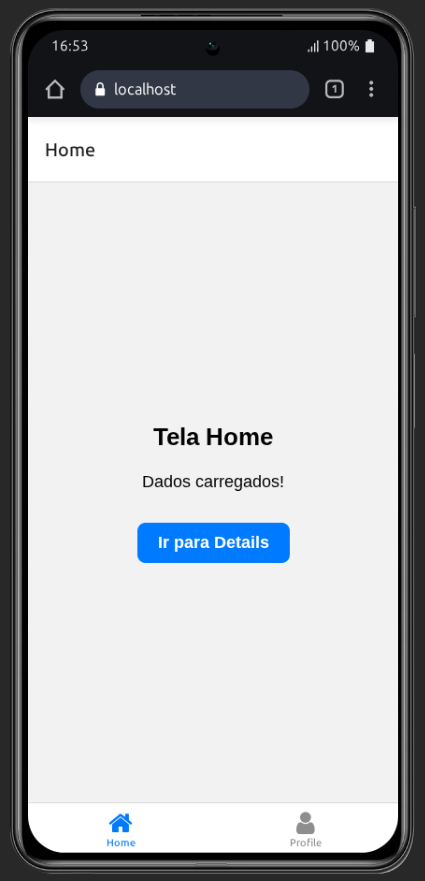
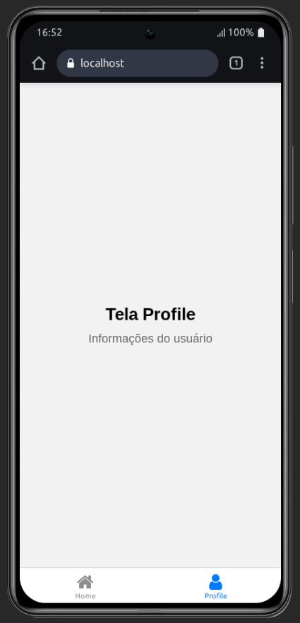

# React Native Navigation App

Este repositório foi construído usando o expo.

## Para começar:

1. Clone o projeto:

   ```bash
   git clone git@github.com:lauanderson-rael/react-native-navegation.git
   ```

2. Instale as depedências:

   ```bash
   npm install
   ```

3. Startando o projeto

   ```bash
   npm run start
   ```

## Navegação do App

**Bottom Tabs:**

- **Home** (com Stack interno)
  - Home → Details (com parâmetros)
- **Profile**

**Deep Links:**

- `app-base-rn://home`
- `app-base-rn://home/details?id=123`
- `app-base-rn://profile`

## Estados Tratados

### Loading

- **Home**: Simulação de carregamento (2s)
- **Details**: Carregamento de detalhes (1.5s)

### Empty

- **Home**: Estado quando não há dados (30% chance)

### Error

- **Details**: Erro de carregamento (40% chance) com botão "Tentar novamente"

## 📁 Estrutura

```
app/
├── _layout.tsx (Stack raiz)
├── index.tsx (Redirect)
└── (tabs)/
    ├── _layout.tsx (Bottom Tabs)
    ├── home/
    │   ├── _layout.tsx (Stack interno)
    │   ├── index.tsx
    │   └── details.tsx
    ├── profile/
        ├── index.tsx
```

## Telas




